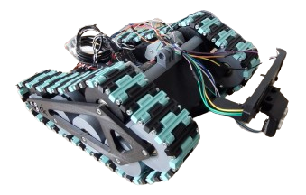
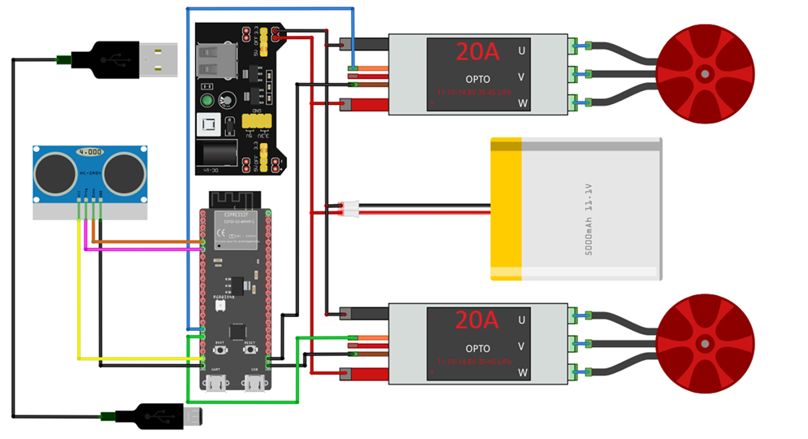

# Controller Design and Implementation for Tracked Vehicle

This repository presents the implementation of advanced control strategies for a small tracked vehicle.

## 📸 Vehicle

## 🚗 Hardware Overview

The platform is a custom-built tracked vehicle consisting of:

- 3D printed chassis
- ESP32-S3 DevKitC-1
- 2× BLDC motors Sunnysky X2212 980KV
- 2× ESC controllers
- HC-SR04 ultrasonic sensor
- Li-Po battery (3S, 11.1 V)
- External 5V regulator (MB102)

## 🔌 Final Hardware Wiring

---

## ⚙️ Firmware Implementation

The ESP32 firmware is responsible for low-level control of the tracked vehicle, including motor actuation, data logging, and communication.

This part is described in more detail in the 📂 [Firmware Implementation](Firmware%20Implementation/) section of the repository, where the following aspects are covered:

* sensor wiring and integration
* data logging and communication
* motor initialization and control

The repository contains individual programs used during development, organized into separate modules for clarity and easier testing.

---

## 🎮 P and PI Controllers

This part of the project focuses on the implementation of feedback control strategies used for distance regulation of the tracked vehicle.

The controllers were developed as an intermediate step before introducing Model Predictive Control, allowing validation of the system behavior and tuning of the sensing and actuation pipeline.

This part is described in more detail in the 📂 [P and PI Controllers](P%20and%20PI%20controllers/) section of the repository, where the following aspects are covered:

* distance measurement and signal filtering  
* implementation of the proportional (P) controller  
* extension to the proportional-integral (PI) controller  
* improvements using median filtering, double EMA filtering, and feedforward action  
* experimental data logging and visualization  

The folder also includes recorded experimental data together with scripts for plotting and evaluating controller performance.
