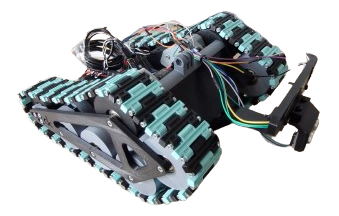
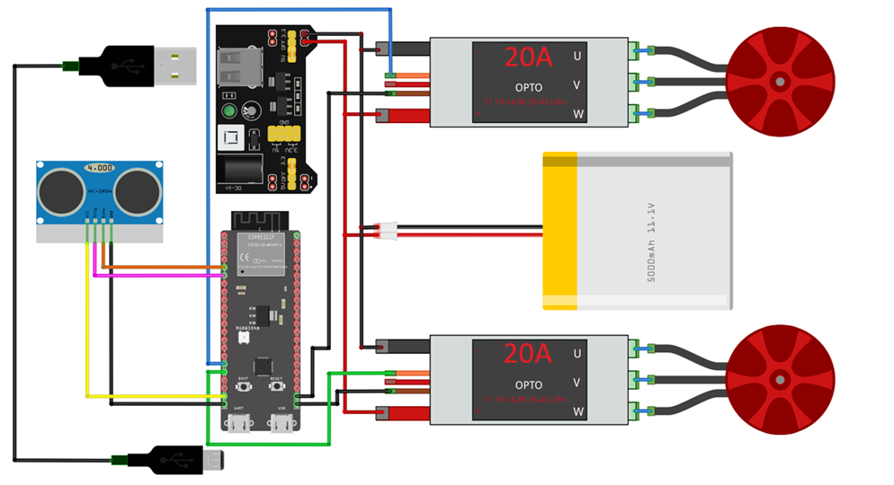

# Controller Design and Implementation for Tracked Vehicle

This repository presents the implementation of advanced control strategies for a tracked vehicle.

## 📸 Tracked Vehicle

## 🚗 Hardware Overview

The platform is a custom-built tracked vehicle consisting of:

- 3D printed chassis
- ESP32-S3 DevKitC-1
- 2× BLDC motors Sunnysky X2212 980KV
- 2× ESC controllers
- HC-SR04 ultrasonic sensor
- Li-Po battery (3S, 11.1 V)
- External 5V regulator (MB102)

## 🔌 Final Hardware Wiring

## ⚙️ Software Implementation

The ESP32 software is responsible for low-level control of the tracked vehicle, including motor actuation, data logging, and communication.

This part is described in more detail in the 📂 [Software Implementation](Software%20Implementation/) section of the repository, where the following aspects are covered:

* sensor wiring and integration
* data logging and communication
* motor initialization and control

The repository contains individual programs used during development, organized into separate modules for clarity and easier testing.

## 🎮 P and PI Controllers

This part of the project focuses on the implementation of feedback control strategies used for distance regulation of the tracked vehicle.

The controllers were developed as an intermediate step before introducing Model Predictive Control, allowing validation of the system behavior and tuning of the sensing and actuation pipeline.

This part is described in more detail in the 📂 [P and PI Controllers](P%20and%20PI%20controllers/) section of the repository, where the following aspects are covered:

* distance measurement and signal filtering  
* implementation of the proportional (P) controller  
* extension to the proportional-integral (PI) controller  
* improvements using median filtering, double EMA filtering, and feedforward action  
* experimental data logging and visualization  

The folder also includes recorded experimental data together with scripts for plotting and evaluating controller performance.

## 📊 System Identification

This part of the project focuses on identifying a dynamic model of the tracked vehicle based on measured experimental data.

The identified model describes the relationship between the input (motor command) and the system output (distance and relative motion), and serves as a foundation for advanced control design.

This step is essential for Model Predictive Control, as it provides a mathematical representation of the system dynamics used for prediction and optimization.

This part is described in more detail in the 📂 [Identification](Identification/) section of the repository, where the following aspects are covered:

* data collection from experiments  
* signal preprocessing and filtering  
* estimation of system dynamics  
* validation of the identified model  

The folder contains datasets, scripts, and results used for model identification and evaluation.

## 🎯 Model Predictive Control

This part of the project focuses on the implementation of advanced predictive control strategies for adaptive cruise control of the tracked vehicle.

Model Predictive Control (MPC) uses a mathematical model of the system to predict future behavior and compute optimal control actions while respecting system constraints.

The implemented approaches extend the previous controller designs by introducing optimization-based control capable of handling input limitations, state constraints, and improved trajectory tracking.

This part is described in more detail in the 📂 [Model Predictive Control](Model%20Predictive%20Control/) section of the repository.

### 🖥️ Online MPC

The Online MPC implementation performs real-time optimization during vehicle operation using the identified dynamic model.

At each sampling instant, the controller predicts future system behavior over a finite prediction horizon and computes an optimal motor command minimizing the tracking error while satisfying constraints.

The Online MPC section covers:

* formulation of the MPC optimization problem  
* prediction horizon and cost function design  
* input and state constraints  
* real-time communication between ESP32 and MATLAB  
* closed-loop experimental validation and visualization  

The folder contains MATLAB implementations, optimization scripts, communication interfaces, and recorded experimental results from real-time MPC operation.

### 🛡️ Tube MPC

The Tube MPC implementation extends the standard MPC framework by introducing robustness against disturbances and model uncertainties.

This approach maintains the system trajectory inside a predefined invariant tube around the nominal predicted trajectory, improving safety and reliability under uncertain operating conditions.

The Tube MPC section covers:

* robust MPC formulation  
* invariant tube generation  
* disturbance handling and constraint tightening  
* implementation using state-space models  
* simulation and experimental evaluation of robust control performance  

The folder contains robust MPC implementations, simulation results, optimization setups, and supporting scripts used for Tube MPC analysis and testing.
